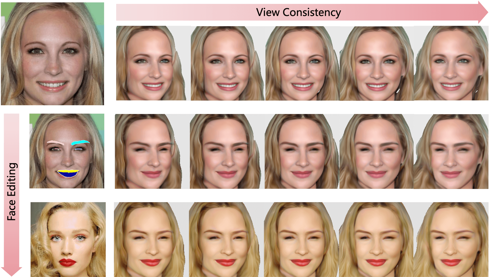

# FENeRF: Face Editing in Radiance Fields<br><sub>Official PyTorch implementation</sub>



**FENeRF: Face Editing in Radiance Fields**<br>
Jingxiang Sun, Xuan Wang, Yong Zhang, Xiaoyu Li, Qi Zhang, Yebin Liu and Jue Wang
<br>
https://mrtornado24.github.io/FENeRF/<br>

Abstract: *Previous portrait image generation methods roughly fall into two categories: 2D GANs and 3D-aware GANs. 2D GANs can generate high fidelity portraits but with low view consistency. 3D-aware GAN methods can maintain view consistency but their generated images are not locally editable. To overcome these limitations, we propose FENeRF, a 3D-aware generator that can produce view-consistent and locally-editable portrait images. Our method uses two decoupled latent codes to generate corresponding facial semantics and texture in a spatial aligned 3D volume with shared geometry. Benefiting from such underlying 3D representation, FENeRF can jointly render the boundary-aligned image and semantic mask and use the semantic mask to edit the 3D volume via GAN inversion. We further show such 3D representation can be learned from widely available monocular image and semantic mask pairs. Moreover, we reveal that joint learning semantics and texture helps to generate finer geometry. Our experiments demonstrate that FENeRF outperforms state-of-the-art methods in various face editing tasks.*

## Data Preparison

We trained our models on CelebAHQ-Mask and FFHQ:

* [FFHQ](https://github.com/NVlabs/stylegan)
* [CelebA](https://github.com/switchablenorms/CelebAMask-HQ)

For FFHQ, we estimate the segmentation map for each portrait image by `prepare_segmaps.py`. We adopt the pretrained face parsing model in [SofGAN](https://github.com/apchenstu/sofgan) and convert semantic categories to the format of CelebA. Please download [pretrained model](https://drive.google.com/file/d/1cJv5Oi0olBWbdkt2wu32f3inLYn4tSZU/view?usp=sharing) and put it into `./checkpoints`.

## Training a Model

```
python train_double_latent_semantic.py --curriculum CelebA_double_semantic_texture_embedding_256_dim_96 --output_dir training-runs/debug --num_gpus 4
```

To continue training from another run specify the `--load_dir=path/to/directory` flag. 

## Model Results

#### Rendering Images and Segmentation Maps
```
python render_multiview_images_double_semantic.py path/to/generator.pth --curriculum CelebA_double_semantic_texture_embedding_256_dim_96 --seeds 0 1 2 3
```

#### Rendering Videos with Disentangled Interpolation
```
python render_video_interpolation_semantic.py path/to/generator.pth --curriculum CelebA_double_semantic_texture_embedding_256_dim_96 --latent_type geo --seeds 0 1 2 3 --trajectory front --save_with_video
```

You can pass the flag `--lock_view_dependence` to remove view dependent effects. This can help mitigate distracting visual artifacts such as shifting eyebrows. However, locking view dependence may lower the visual quality of images (edges may be blurrier etc.)


#### Extracting 3D Shapes

`python extract_double_semantic_shapes.py path/to/generator.pth --seed 0`

#### Real Portrait Editing

1. Inversion. Given a reference portrait image and its segmentation map, run `inverse_render_double_semantic.py` to obtain its latent codes stored as `freq_phase_offset_$exp_name.pth`:

```
python inverse_render_double_semantic.py exp_name path/to/generator.pth --image_path data/examples/image.jpg --seg_path data/examples/mask.png --background_mask --image_size 128 --latent_normalize --lambda_seg 1. --lambda_img 0.2 --lambda_percept 1. --lock_view_dependence True --recon
```

2. Editing Shape. Edit the segmentation map using our UI platform: `python ./Painter/run_UI.py`. You can load a segmentation map and edit it. 
Press the 'Save Img' button after editing. Then load the latent code obtained in Step 1 and run inversion again:


```

python inverse_render_double_semantic.py exp_name path/to/generator.pth --image_path data/examples/image.jpg --seg_path data/examples/mask_edit.png --background_mask --image_size 128 --latent_normalize --lambda_seg 1. --lambda_img 0 --lambda_percept 0 --lock_view_dependence True --recon --load_checkpoint True --checkpoint_path freq_phase_offset_$exp_name.pth
```
After that you can find a free-view rendering video of the edited portrait in the saving directory.

3. Editing global appearance. Given the inverted latent codes of the Portrait A and B, you can transfer B's appearance to A by swapping `w_app_phase_shifts`, `w_app_frequency_offsets`, `w_app_phase_shift_offsets` of A with B.

## Pretrained Models
We provide pretrained models for FENeRF w/ latent grid and w/o latent grid.

FENeRF w/o latent grid: https://drive.google.com/file/d/1RZvQ7a0sC6k0_N85by71Tepchk_wBBQF/view?usp=sharing

FENeRF w/ latent grid: https://drive.google.com/file/d/1ObhhxPTeuTBOOJwxOL3_xzwBFJIh3Jqg/view?usp=sharing

## Citation

```
@InProceedings{Sun_2022_CVPR,
    author    = {Sun, Jingxiang and Wang, Xuan and Zhang, Yong and Li, Xiaoyu and Zhang, Qi and Liu, Yebin and Wang, Jue},
    title     = {FENeRF: Face Editing in Neural Radiance Fields},
    booktitle = {Proceedings of the IEEE/CVF Conference on Computer Vision and Pattern Recognition (CVPR)},
    month     = {June},
    year      = {2022},
    pages     = {7672-7682}
}
```


## Acknowledgments

- pi-GAN from [https://github.com/marcoamonteiro/pi-GAN](https://github.com/marcoamonteiro/pi-GAN)
- SofGAN from [https://github.com/apchenstu/sofgan](https://github.com/apchenstu/sofgan)
